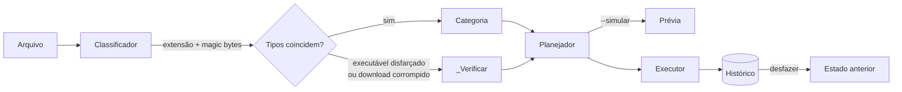

<div align="center">

# FileSense

### Organização de arquivos guiada pelo conteúdo, não pelo nome.

Classifica arquivos pela assinatura binária real, isola executáveis disfarçados,<br>
elimina duplicados e mantém um histórico totalmente reversível.

<br>

[](https://github.com/AnnaDevv/FileSense/actions/workflows/ci.yml)


[Visão geral](#visão-geral) ·
[Recursos](#recursos) ·
[Instalação](#instalação) ·
[Uso](#uso) ·
[Arquitetura](#arquitetura) ·
[Decisões técnicas](#decisões-técnicas) ·
[Roadmap](#roadmap)

</div>

<br>

```text
$ filesense organizar

Organizando C:\Users\ana\Downloads

_Verificar (2)
  artigo_cientifico.pdf
    ⚠ é uma página HTML, não um .pdf (o download provavelmente falhou)
  boleto_vencido_2via.pdf
    ⚠ diz ser .pdf, mas é um programa executável

Documentos (2)
  Curriculo_Ana_Silva.pdf
  anotacoes.txt

Imagens (4)
  IMG_20260812_143022.jpg
  comprovante_pix.png
  comprovante_pix (1).png
  screenshot

✓ 12 arquivo(s) organizados (21.1 MB). Mudou de ideia? Rode: filesense desfazer
⚠ 1 arquivo(s) com cara de golpe foram para _Verificar/. Não abra antes de conferir.
```

<br>

## Visão geral

Pastas como *Downloads* acumulam comprovantes, instaladores esquecidos, o mesmo PDF baixado várias vezes e imagens sem nome. Organizadores convencionais separam tudo pela extensão, o que os torna fáceis de enganar: um executável renomeado para `boleto.pdf` é tratado como documento.

O **FileSense** lê os primeiros bytes de cada arquivo e compara o tipo real com o tipo declarado. A partir disso, organiza com precisão, sinaliza riscos e registra cada operação para que possa ser desfeita.

<table>
<tr>
<th align="left"></th>
<th align="center">Organizador comum</th>
<th align="center">FileSense</th>
</tr>
<tr><td>Classificação</td><td align="center">Pela extensão</td><td align="center"><b>Pelo conteúdo real</b></td></tr>
<tr><td>Arquivos sem extensão</td><td align="center">Ignorados</td><td align="center"><b>Identificados</b></td></tr>
<tr><td>Executáveis disfarçados</td><td align="center">Passam despercebidos</td><td align="center"><b>Isolados em quarentena</b></td></tr>
<tr><td>Downloads corrompidos</td><td align="center">Não detectados</td><td align="center"><b>Sinalizados</b></td></tr>
<tr><td>Duplicados</td><td align="center">Pelo nome</td><td align="center"><b>Pelo conteúdo (hash)</b></td></tr>
<tr><td>Reverter operações</td><td align="center">Manual</td><td align="center"><b>Um comando</b></td></tr>
</table>

## Recursos

**Classificação por assinatura binária.** Identifica mais de 20 formatos pelos *magic bytes*, incluindo contêineres ZIP (Office, instaladores MSIX), ISO Base Media (MP4, HEIC) e executáveis PE validados pela estrutura do cabeçalho.

**Detecção de ameaças.** Executáveis que se passam por documentos são movidos para `_Verificar/` com um alerta explícito. Arquivos cujo conteúdo é uma página HTML de erro são reconhecidos como downloads que falharam.

**Deduplicação eficiente.** Arquivos idênticos são encontrados em três etapas de custo crescente, e as cópias são movidas para revisão. Nada é apagado.

**Histórico reversível.** Toda operação é registrada. `filesense desfazer` restaura o estado anterior e remove as pastas que ficaram vazias.

**Modo contínuo.** `filesense vigiar` organiza cada novo arquivo assim que o download termina.

**Relatórios.** Distribuição de espaço por categoria, maiores arquivos, arquivos inativos e itens suspeitos.

**Seguro por padrão.** Modo de simulação, proteção contra sobrescrita, e downloads em andamento, arquivos ocultos e temporários são ignorados automaticamente.

**Sem dependências.** Construído apenas com a biblioteca padrão do Python.

## Instalação

Requer **Python 3.11** ou superior.

```bash
pip install git+https://github.com/AnnaDevv/FileSense.git
```

<details>
<summary><b>Instalação para desenvolvimento</b></summary>

<br>

```bash
git clone https://github.com/AnnaDevv/FileSense.git
cd FileSense
python -m venv .venv
source .venv/bin/activate      # Windows: .venv\Scripts\Activate.ps1
pip install -e ".[dev]"
pytest
```

</details>

## Uso

Sem uma pasta informada, o FileSense atua sobre `~/Downloads`.

```bash
filesense organizar --simular      # exibe o plano sem alterar nada
filesense organizar                # organiza a pasta
filesense desfazer                 # reverte a última operação
```

| Comando | Descrição |
|:--|:--|
| `organizar [pasta]` | Separa os arquivos em categorias. `--simular` para prévia, `--por-data` para subpastas por ano-mês |
| `duplicados [pasta]` | Lista arquivos com conteúdo idêntico. `--mover` envia as cópias para `_Duplicados/` |
| `relatorio [pasta]` | Exibe uso de espaço, arquivos inativos (`--dias N`) e itens suspeitos |
| `vigiar [pasta]` | Organiza continuamente. `--intervalo N` define a frequência em segundos |
| `desfazer` | Restaura os arquivos da operação mais recente |
| `historico` | Lista as operações registradas |
| `config` | Exibe a configuração ativa. `--criar` gera um arquivo de exemplo |

<details>
<summary><b>Execução automática</b></summary>

<br>

**Windows.** Crie um atalho para `pythonw -m filesense vigiar` e coloque-o na pasta de inicialização (`Win + R` → `shell:startup`).

**macOS e Linux.** Agende a organização periódica com `cron`:

```cron
0 * * * * filesense organizar
```

</details>

<details>
<summary><b>Configuração personalizada</b></summary>

<br>

Gere um arquivo de exemplo com `filesense config --criar`. Ele é salvo em `~/.filesense/filesense.toml`:

```toml
[geral]
por_data = false
idade_minima_segundos = 5
ignorar = ["*.iso"]

[categorias]
"Notas Fiscais" = ["xml"]
"Modelos 3D" = ["stl", "obj", "blend"]
```

Extensões atribuídas a uma categoria personalizada deixam de pertencer à categoria padrão. Valores inválidos produzem mensagens de erro específicas, como `[geral].idade_minima_segundos deve ser um número inteiro`.

</details>

## Arquitetura



```text
src/filesense/
├── classifier.py    Identificação por extensão e assinatura binária
├── organizer.py     Planejamento e execução das movimentações
├── duplicates.py    Deduplicação em três etapas
├── history.py       Registro em JSON Lines e reversão
├── report.py        Estatísticas da pasta
├── watcher.py       Modo contínuo
├── config.py        Configuração padrão e validação do TOML
└── cli.py           Interface de linha de comando
```

## Decisões técnicas

**Planejamento separado da execução.** `planejar()` calcula o destino de cada arquivo sem tocar no disco, e `executar()` aplica o plano. Essa separação torna o modo de simulação trivial e deixa a lógica de decisão testável de forma isolada.

**Deduplicação em três etapas.** Calcular o hash de todos os arquivos seria custoso. Os candidatos são agrupados primeiro por tamanho, depois pelo hash dos primeiros 64 KB e, por fim, pelo hash completo (BLAKE2b). A maioria dos arquivos é descartada sem ser lida por inteiro.

**Alertas apenas com evidência.** Formatos de texto não têm assinatura binária, então o FileSense nunca afirma que um `.txt` está incorreto. Divergências só são reportadas para formatos verificáveis pelo conteúdo, o que elimina falsos positivos.

**Validação estrutural de executáveis.** O prefixo `MZ` não basta. O FileSense segue o ponteiro `e_lfanew` do cabeçalho DOS e confirma a assinatura `PE\0\0`, o mesmo critério usado pelo carregador do Windows.

**Persistência atômica.** O histórico usa JSON Lines e é regravado com `os.replace`, garantindo que nunca fique em estado parcial. A reversão se recusa a sobrescrever arquivos que tenham surgido no local original.

**Monitoramento por polling.** O modo contínuo verifica a pasta periodicamente em vez de depender de eventos do sistema operacional. O comportamento é idêntico em todas as plataformas, sem dependências, e se integra à regra de idade mínima que aguarda a conclusão dos downloads.

<details>
<summary><b>Estudo de caso: um bug encontrado em uso real</b></summary>

<br>

No primeiro uso sobre uma pasta *Downloads* real, um instalador `.msix` e um projeto do CorelDRAW (`.cdr`) foram classificados como arquivos compactados. Ambos são contêineres ZIP, e o FileSense recorria ao conteúdo sempre que não reconhecia a extensão.

A correção teve duas partes: as extensões foram mapeadas para suas categorias corretas, e arquivos com extensão desconhecida e conteúdo ZIP passaram a ser enviados para *Outros*, já que muitos formatos modernos usam ZIP como contêiner. O cenário está coberto por testes de regressão em `tests/test_classifier.py`.

</details>

## Qualidade

```bash
pytest -v          # 37 testes
ruff check .       # lint
```

A suíte cobre classificação, detecção de ameaças, conflitos de nome, reversão, deduplicação (incluindo arquivos idênticos no início e distintos no final), validação de configuração e a interface de linha de comando. A integração contínua executa tudo em **Windows, macOS e Linux** com **Python 3.11, 3.12 e 3.13**.

## Roadmap

- [ ] Interface gráfica com ícone na bandeja do sistema
- [ ] Regras baseadas em padrões de nome (ex.: `*nota*fiscal*` → Notas Fiscais)
- [ ] Limpeza programada de `_Duplicados/` com confirmação
- [ ] Publicação no PyPI

## Licença

Distribuído sob a licença MIT. Consulte [LICENSE](LICENSE) para mais detalhes.

<br>

<div align="center">

Desenvolvido por **[Ana Silva](https://github.com/AnnaDevv)**

</div>
